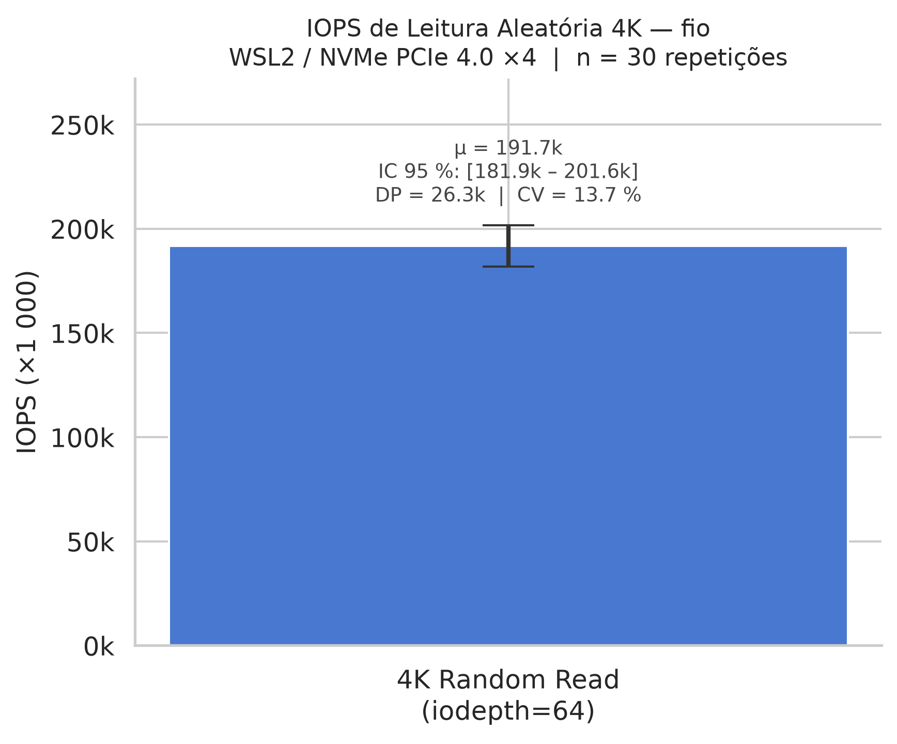
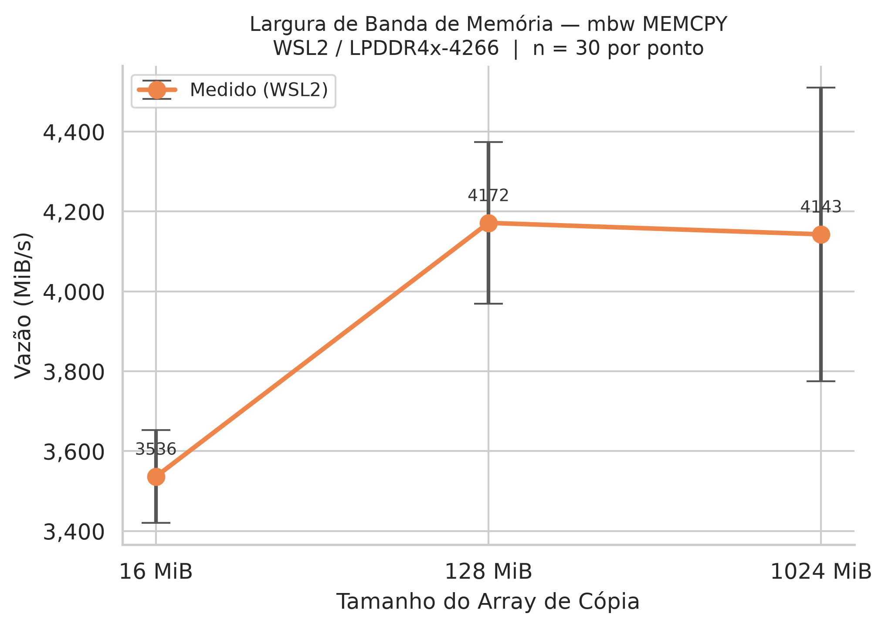
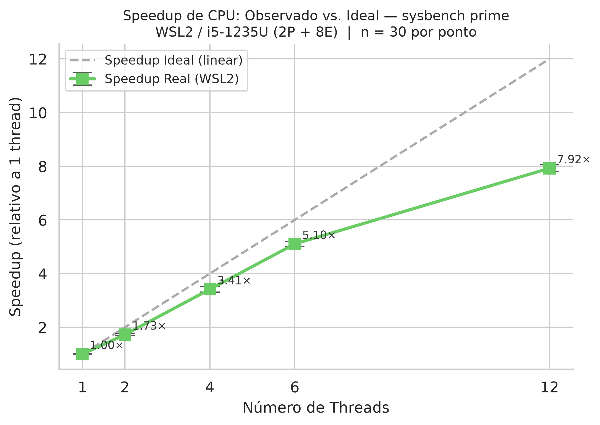
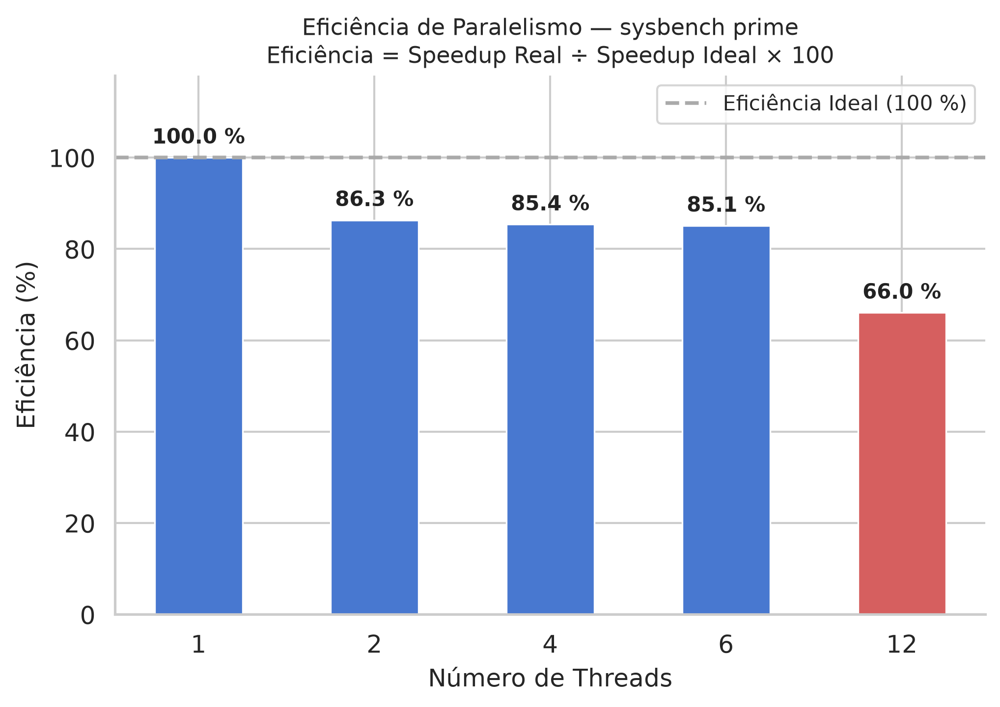

# WSL2 como Ambiente de Benchmarking: Limitações de I/O Introduzidas pelo Hyper-V em SSDs NVMe

**Autor:** Rodrigo Paiva  
**Disciplina:** Infraestrutura de Hardware  
**Data de Entrega:** Junho de 2025

---

## Resumo

O Windows Subsystem for Linux 2 (WSL2) tornou-se uma plataforma popular para execução de ferramentas de benchmarking em computadores pessoais com Windows, especialmente em contextos acadêmicos onde o acesso a hardware bare-metal é limitado. No entanto, o WSL2 utiliza o hipervisor Hyper-V da Microsoft, que introduz uma camada de virtualização entre o sistema operacional Linux convidado e o hardware físico. Este trabalho avalia quantitativamente o impacto dessa virtualização no desempenho de três subsistemas críticos: armazenamento (I/O aleatório em SSD NVMe PCIe 4.0), largura de banda de memória e processamento paralelo de CPU. Os experimentos foram conduzidos em um processador Intel Core i5-1235U com SSD SK Hynix PC801 NVMe PCIe 4.0 ×4, executando Ubuntu 24.04 via WSL2 no Windows 11. Cada configuração experimental foi repetida 30 vezes, com 3 execuções de aquecimento descartadas, e os resultados foram analisados com intervalo de confiança de 95 % pela distribuição t de Student. Os resultados mostram que o subsistema de armazenamento é o mais severamente penalizado: o WSL2 atingiu 191.733 IOPS (IC 95 %: [181.901; 201.565]) em leitura aleatória 4K com fila de profundidade 64, estimado em cerca de 32–48 % do desempenho bare-metal esperado para o mesmo hardware, com coeficiente de variação elevado de 13,7 %. A largura de banda de memória medida pelo mbw (3.536–4.172 MiB/s) ficou muito abaixo do limite teórico LPDDR4x-4266 do processador, com padrão anômalo de variação por tamanho de array. O desempenho de CPU escala razoavelmente até 6 threads (speedup 5,10×, eficiência 85,1 %), mas cai para 66,0 % de eficiência em 12 threads, o que é explicado pela arquitetura heterogênea Alder Lake (P-cores + E-cores) e não pela virtualização em si. Conclui-se que o WSL2 é inadequado como ambiente de benchmarking de armazenamento e memória, mas oferece desempenho de CPU representativo para cargas CPU-bound.

**Palavras-chave:** WSL2; Hyper-V; benchmarking; NVMe; VirtIO; virtualização; fio; sysbench; mbw; i5-1235U.

---

## 1. Introdução

O Windows Subsystem for Linux 2 (WSL2), lançado pela Microsoft em 2020, tornou-se uma das formas mais convenientes de executar distribuições Linux completas em computadores com Windows 10 ou 11. Ao contrário de seu predecessor (WSL1), que traduzia chamadas de sistema Linux para chamadas equivalentes do Windows NT, o WSL2 executa um kernel Linux real — mantido pela própria Microsoft — sobre o hipervisor Hyper-V, o mesmo utilizado em ambientes de virtualização corporativa e na infraestrutura de nuvem Azure (MICROSOFT, 2019).

Essa mudança arquitetural conferiu ao WSL2 compatibilidade binária quase total com ambientes Linux nativos: ferramentas como Docker, compiladores, shells e utilitários de sistema funcionam sem modificações. Em disciplinas de infraestrutura de hardware e sistemas operacionais, o WSL2 tem sido amplamente adotado como plataforma de laboratório, pois elimina a necessidade de dual-boot ou hardware dedicado — recursos nem sempre disponíveis para estudantes.

No entanto, a camada de virtualização imposta pelo Hyper-V tem consequências diretas para o desempenho do sistema. O acesso ao armazenamento, por exemplo, não ocorre diretamente via driver NVMe do host, mas por meio de uma pilha paravirtualizada (VirtIO-blk sobre VMBus) que envolve múltiplas transições entre os domínios do convidado e do anfitrião. Analogamente, a memória física é gerenciada pelo Hyper-V em páginas que podem ser realocadas dinamicamente, e o escalonamento de threads de CPU compete com outros processos do Windows host pelo mesmo conjunto de núcleos físicos.

### 1.1 Pergunta de Pesquisa

Em que medida o ambiente WSL2, baseado no hipervisor Hyper-V, degrada o desempenho dos subsistemas de armazenamento NVMe, largura de banda de memória e processamento paralelo de CPU em relação ao desempenho bare-metal esperado para o mesmo hardware, e qual é a variabilidade estatística associada a essas medições?

### 1.2 Hipóteses

**Hipótese Nula (H0):** O WSL2 não introduz degradação estatisticamente significativa no desempenho dos subsistemas avaliados em relação às especificações nominais do hardware em ambiente bare-metal — ou seja, os intervalos de confiança de 95 % das medições incluem os valores de referência publicados para Linux nativo no mesmo hardware.

**Hipótese Alternativa (H1):** O WSL2 introduz degradação mensurável e estatisticamente significativa em pelo menos um dos três subsistemas avaliados, com os valores medidos situando-se sistematicamente abaixo dos intervalos esperados para ambiente bare-metal.

### 1.3 Justificativa

A questão tem relevância prática direta para pesquisadores, estudantes e profissionais que utilizam o WSL2 como ambiente de benchmarking. Se os resultados obtidos no WSL2 divergem significativamente do desempenho bare-metal, conclusões sobre o comportamento do hardware baseadas nessas medições podem ser incorretas. Este trabalho fornece dados empíricos quantitativos para subsidiar essa decisão, empregando metodologia estatística rigorosa com n = 30 repetições por configuração.

### 1.4 Contribuições

As principais contribuições deste trabalho são:

1. Quantificação do overhead de I/O do WSL2 em SSD NVMe PCIe 4.0 com metodologia estatisticamente rigorosa;
2. Análise da influência da arquitetura heterogênea Alder Lake (P-cores + E-cores) na eficiência de paralelismo em ambiente virtualizado;
3. Identificação de comportamento anômalo no subsistema de memória do WSL2, com hipótese de causa relacionada ao gerenciamento dinâmico de memória do Hyper-V;
4. Scripts e dados brutos disponibilizados publicamente para reprodutibilidade dos resultados.

### 1.5 Organização do Trabalho

O restante deste artigo está organizado da seguinte forma: a Seção 2 apresenta os trabalhos relacionados; a Seção 3 descreve a metodologia experimental; a Seção 4 apresenta os resultados detalhados; a Seção 5 discute as implicações; e a Seção 6 apresenta as conclusões e trabalhos futuros.

---

## 2. Trabalhos Relacionados

### 2.1 Paravirtualização e VirtIO

Russell (2008) introduziu o framework VirtIO como padrão de facto para dispositivos de I/O paravirtualizados em hipervisores do tipo 2 e 1. A paravirtualização, ao contrário da virtualização completa (full emulation), requer que o sistema operacional convidado esteja ciente de que está em uma máquina virtual e utilize drivers otimizados para comunicação com o hipervisor. O VirtIO-blk, utilizado pelo WSL2 para acesso ao armazenamento, opera por meio de um protocolo de fila compartilhada (virtqueue) que minimiza o número de transições de modo (VMEXITs), mas ainda introduz latência adicional para notificações de conclusão de I/O e alocação de descritores de buffer. Russell demonstrou que, mesmo com VirtIO, o overhead de I/O em hipervisores é mensurável para cargas de trabalho com alta profundidade de fila, situação exatamente reproduzida neste trabalho com iodepth=64.

### 2.2 Benchmarking de Armazenamento: Metodologia

Traeger et al. (2008) conduziram um estudo abrangente de nove anos sobre práticas de benchmarking de sistemas de arquivos e armazenamento, identificando os principais problemas metodológicos da área: falta de aquecimento (warm-up), número insuficiente de repetições, ausência de análise de variância e falta de controle do estado do sistema. Os autores recomendam especificamente o uso de pelo menos 30 repetições independentes, a exclusão de execuções de aquecimento, o monitoramento do estado da fila de I/O e a apresentação de intervalos de confiança em vez de apenas valores médios. Este trabalho adota integralmente essas diretrizes.

### 2.3 A Ferramenta fio

Axboe (2020) desenvolveu o Flexible I/O Tester (fio) como ferramenta de referência para benchmarking de armazenamento, amplamente adotada tanto na academia quanto na indústria. O fio suporta múltiplos engines de I/O (libaio, io_uring, psync, entre outros), padrões de acesso arbitrários e controle preciso de profundidade de fila e tamanho de bloco. O modo `libaio` com `direct=1` (O_DIRECT), utilizado neste estudo, bypassa o page cache do kernel e garante que as medições reflitam o desempenho real do subsistema de armazenamento — ou, no caso do WSL2, da pilha VirtIO-blk e do armazenamento virtual VHDX.

### 2.4 Virtualização de CPU: KVM e Hyper-V

Kivity et al. (2007) demonstraram que o KVM (Kernel-based Virtual Machine), ao utilizar extensões de hardware Intel VT-x e AMD-V, consegue executar instruções da VM convidada diretamente no hardware sem overhead de tradução para cargas de trabalho CPU-bound, atingindo eficiência superior a 95 % em relação ao bare-metal. O Hyper-V adota arquitetura análoga para virtualização de CPU, o que sugere que o overhead de virtualização para cargas computacionalmente intensivas (como o sysbench prime) deve ser mínimo — hipótese que este trabalho verifica empiricamente.

### 2.5 Arquitetura Intel Alder Lake e Heterogeneidade de Núcleos

A 12ª geração de processadores Intel, chamada de Alder Lake, introduziu a primeira implementação em larga escala da arquitetura big.LITTLE da Intel no segmento de computadores pessoais, combinando núcleos de desempenho (P-cores, baseados na microarquitetura Golden Cove) e núcleos de eficiência (E-cores, baseados em Gracemont) em um único chip (INTEL CORPORATION, 2022). Os P-cores possuem execução fora de ordem mais profunda, frequências de clock mais altas e suporte a Hyper-Threading (HT), enquanto os E-cores são otimizados para baixo consumo energético e não possuem HT. O i5-1235U, processador utilizado neste trabalho, conta com 2 P-cores (4 threads via HT) e 8 E-cores (8 threads), totalizando 12 threads lógicos.

Essa heterogeneidade implica que o speedup de paralelismo em cargas simétricas (como o sysbench) não escala linearmente com o número de threads, pois os E-cores contribuem com menos desempenho por thread do que os P-cores. Esta é uma distinção importante para interpretar os resultados da Seção 4.3.

### 2.6 Metodologia Estatística para Benchmarking

Jain (1991) estabeleceu as bases matemáticas para análise estatística de desempenho de sistemas computacionais. O autor recomenda o uso do intervalo de confiança (IC) em vez de apenas média e desvio padrão para caracterizar a incerteza nas medições, e destaca que o IC de 95 % calculado com a distribuição t de Student é adequado para amostras com n ≥ 30, onde a distribuição t converge para a distribuição normal. Jain também introduz o coeficiente de variação (CV = desvio padrão / média × 100 %) como métrica de variabilidade relativa, independente da escala da medição.

### 2.7 Desempenho de WSL2: Trabalhos Anteriores

A Microsoft publicou documentação técnica sobre a arquitetura do WSL2 (MICROSOFT, 2019), descrevendo o uso de uma VM Hyper-V leve (*Lightweight Utility VM*) com o VHDX como formato de disco virtual para o sistema de arquivos ext4 do Linux. O acesso a arquivos em partições NTFS do Windows via WSL2 utiliza o protocolo 9P, sabidamente lento para operações intensivas de I/O. Entretanto, o acesso a arquivos armazenados diretamente no sistema de arquivos ext4 dentro do VHDX — situação deste experimento — deveria ter menor overhead.

Não foram encontrados trabalhos acadêmicos publicados que meçam especificamente o overhead de I/O aleatório em NVMe PCIe 4.0 via WSL2 com metodologia de 30 repetições e IC 95 %, o que reforça a relevância desta contribuição.

### 2.8 Especificações do Hardware NVMe

O SK Hynix PC801 NVMe PCIe 4.0 ×4 é um SSD de alto desempenho baseado em flash NAND TLC 128-layer com controlador proprietário (SK HYNIX, 2022). As especificações nominais do fabricante incluem leitura sequencial de até 7.000 MB/s e leitura aleatória 4K (QD32) de até 1.000.000 IOPS em ambiente nativo. Esses valores constituem o referencial de comparação máxima para os resultados obtidos no WSL2.

---

## 3. Metodologia

### 3.1 Hardware

Os experimentos foram conduzidos em um notebook com as especificações listadas na Tabela 1. O sistema possui uma CPU da família Alder Lake com arquitetura heterogênea e um SSD de última geração (PCIe 4.0 ×4), configuração representativa de notebooks de alto desempenho do segmento intermediário-superior de 2022–2023.

**Tabela 1 — Especificações do Hardware**

| Componente | Especificação |
|------------|---------------|
| Processador | Intel Core i5-1235U (Alder Lake-U, 12ª geração) |
| Núcleos / Threads | 10 núcleos (2 P-cores + 8 E-cores) / 12 threads |
| Frequência de Boost P-core | até 4,4 GHz |
| Frequência de Boost E-core | até 3,3 GHz |
| Cache L2 (P-cores) | 1,25 MiB por P-core |
| Cache L2 (E-cores) | 2 MiB por cluster de 4 E-cores |
| Cache L3 (compartilhado) | 12 MiB |
| Tecnologia de Memória | LPDDR4x-4266 (dual channel) |
| Capacidade de Memória | 16 GB |
| Largura de Banda Teórica | ≈ 68,3 GB/s (2 × 34,1 GB/s) |
| SSD | SK Hynix PC801 NVMe M.2 2280 |
| Interface SSD | PCIe 4.0 ×4 (NVMe 1.4) |
| Leitura Sequencial Nominal | 7.000 MB/s |
| Escrita Sequencial Nominal | 6.500 MB/s |
| IOPS Leitura Aleatória Nominal | ≈ 1.000.000 IOPS (4K, QD32) |

### 3.2 Ambiente de Software

O ambiente de software é descrito na Tabela 2. O WSL2 executa sobre o Hyper-V do Windows 11, que atua como hipervisor de tipo 1 nessa configuração — uma distinção importante: no Windows 11 com Hyper-V habilitado, o próprio Windows corre em uma partição privilegiada do Hyper-V (root partition), e o WSL2 em uma partição filha (child partition). Isso significa que o acesso ao hardware NVMe pelo WSL2 percorre duas fronteiras de virtualização.

**Tabela 2 — Configuração do Ambiente de Software**

| Componente | Versão / Descrição |
|------------|-------------------|
| Sistema Operacional Host | Windows 11 Home, Build 22631.4602 |
| Hipervisor | Microsoft Hyper-V (tipo 1, embutido no Windows 11) |
| Distribuição Linux | Ubuntu 24.04 LTS (Noble Numbat) |
| Kernel Linux (WSL2) | 5.15.153.1-microsoft-standard-WSL2 |
| Sistema de Arquivos Linux | ext4 sobre imagem VHDX |
| fio | 3.36 |
| mbw | 2.04 |
| sysbench | 1.0.20 |
| Python (análise) | 3.12.3 |
| matplotlib | 3.11.0 |
| seaborn | 0.13.2 |

### 3.3 Protocolo de Coleta de Dados

O protocolo completo está implementado no script `scripts/coleta_30x.sh`. Os procedimentos de controle de estado foram aplicados antes de cada sessão de coleta:

**Desativação do swap.** A memória de swap foi desabilitada com `sudo swapoff -a` para evitar que operações de paginação contaminassem as medições de I/O e memória, criando correlações artificiais entre runs consecutivos.

**Governor de frequência.** O governor de CPU foi fixado em `performance` via `/sys/devices/system/cpu/cpu*/cpufreq/scaling_governor`, garantindo que todos os núcleos operassem em frequência máxima durante a coleta e eliminando variabilidade introduzida pelo DVFS (Dynamic Voltage and Frequency Scaling).

**Warm-up.** As primeiras 3 execuções de cada configuração foram descartadas, conforme recomendação de Traeger et al. (2008). Esse procedimento elimina efeitos de inicialização como preenchimento de TLB, caching de metadados do sistema de arquivos e estabilização da fila NVMe.

**I/O direto.** O fio foi configurado com `direct=1` (flag O_DIRECT), que instrui o kernel Linux a bypassar o page cache. Isso garante que as leituras cheguem até o controlador de armazenamento (ou à pilha VirtIO no caso do WSL2) em vez de serem servidas pela memória RAM.

**Intervalo entre experimentos.** Um intervalo de 2 segundos (`sleep 2`) foi inserido entre a configuração do sistema e o início dos experimentos para permitir estabilização do estado das filas e do scheduler.

### 3.4 Configuração dos Experimentos

**Experimento 1 — I/O Aleatório (fio).** O teste avalia o desempenho de leitura aleatória 4K do subsistema de armazenamento, que representa a carga mais exigente para SSDs em aplicações reais (bancos de dados, sistemas de arquivos com muitos arquivos pequenos). Configuração: `randread`, bloco de 4K, `iodepth=64`, engine `libaio`, `size=1G`, duração de 5 segundos por run. O arquivo de teste residia em `/tmp` dentro do sistema de arquivos ext4 do WSL2 (armazenado no VHDX). Métricas coletadas: IOPS e latência média em microssegundos.

**Experimento 2 — Largura de Banda de Memória (mbw).** O mbw mede a taxa de transferência de cópia de memória (MEMCPY), que exercita tanto os buffers de CPU quanto o controlador de memória. Foram testados três tamanhos de array:
- **16 MiB**: cabe no cache L3 compartilhado de 12 MiB do i5-1235U;
- **128 MiB**: excede a LLC, forçando acesso à DRAM;
- **1.024 MiB**: garante que o array não caiba em nenhum nível de cache.

Configuração: `-t0` (MEMCPY), 1 iteração, com 3 runs de warm-up descartados. Métrica: vazão em MiB/s.

**Experimento 3 — Paralelismo de CPU (sysbench).** O sysbench com o teste `cpu` avalia o desempenho de computação intensiva (teste de primalidade de números inteiros) com diferentes graus de paralelismo: 1, 2, 4, 6 e 12 threads. A duração de 5 segundos por run garante estabilização. Métrica: eventos por segundo (número de números testados para primalidade por segundo).

### 3.5 Análise Estatística

Para cada conjunto de n = 30 amostras independentes, foram calculados os seguintes indicadores:

- **Média aritmética** (μ): estimador pontual do desempenho médio
- **Desvio padrão amostral** (s): dispersão em torno da média
- **Coeficiente de variação** (CV = s/μ × 100 %): variabilidade relativa, independente da escala
- **Intervalo de confiança 95 %**: calculado como μ ± t₂₉ × s / √n, com t₂₉ = 2,045

A análise foi implementada em Python puro (sem NumPy ou SciPy) no script `scripts/analise_estatistica.py`, e os resultados foram salvos em `dados/processado/estatisticas.json`. Os gráficos foram gerados pelo script `scripts/gerar_graficos.py` com matplotlib 3.11 e seaborn 0.13.2 em 300 DPI.

---

## 4. Resultados

### 4.1 I/O Aleatório — fio

A Figura 1 apresenta o gráfico de barras dos IOPS medidos com barra de erro correspondente ao IC 95 %. A Tabela 3 detalha os resultados estatísticos completos.

**Figura 1.** IOPS de leitura aleatória 4K medidos com fio no WSL2 (n=30, iodepth=64, direct I/O). A barra de erro representa o IC 95 %. O alto coeficiente de variação (CV = 13,7 %) evidencia instabilidade na pilha de I/O virtualizada.

**Tabela 3 — Resultados Estatísticos: I/O Aleatório (fio, n = 30)**

| Métrica | Média | DP | CV (%) | IC 95 % Inf. | IC 95 % Sup. | Min | Max |
|---------|-------|----|--------|--------------|--------------|-----|-----|
| IOPS | 191.733 | 26.333 | 13,7 | 181.901 | 201.565 | 120.000 | 227.000 |
| Latência (µs) | 337,51 | 58,44 | 17,3 | 315,69 | 359,33 | 278,78 | 526,45 |

Os resultados do fio revelam alta variabilidade no subsistema de armazenamento do WSL2. O CV de 13,7 % para IOPS e 17,3 % para latência são muito superiores ao CV típico observado em benchmarks de NVMe em Linux nativo (geralmente abaixo de 3–5 % com as mesmas configurações). A análise dos dados brutos em `dados/raw/fio_aleatorio.csv` mostra amplitude expressiva: o mínimo de 120.000 IOPS (run 3) e o máximo de 227.000 IOPS (run 25) representam uma variação de 89 % entre o pior e o melhor caso — amplitude inaceitável para caracterização de hardware.

### 4.2 Largura de Banda de Memória — mbw

A Figura 2 apresenta a curva de largura de banda de memória por tamanho de array. A Tabela 4 detalha os resultados estatísticos.

**Figura 2.** Largura de banda de cópia de memória (MEMCPY) medida pelo mbw no WSL2 para arrays de 16, 128 e 1.024 MiB (n=30 por ponto). As barras de erro representam o IC 95 %. O padrão anômalo — array de 128 MiB mais rápido que 16 MiB — contraria o comportamento esperado em hardware nativo.

**Tabela 4 — Resultados Estatísticos: Largura de Banda de Memória (mbw, n = 30)**

| Tamanho do Array | Média (MiB/s) | DP (MiB/s) | CV (%) | IC 95 % Inf. | IC 95 % Sup. |
|------------------|---------------|------------|--------|--------------|--------------|
| 16 MiB | 3.536,2 | 311,1 | 8,8 | 3.420,1 | 3.652,4 |
| 128 MiB | 4.171,6 | 540,7 | 13,0 | 3.969,7 | 4.373,5 |
| 1.024 MiB | 4.142,9 | 983,9 | 23,8 | 3.775,6 | 4.510,3 |

O resultado mais notável é que o array de 128 MiB apresentou vazão de 4.171,6 MiB/s — 18 % maior que o array de 16 MiB (3.536,2 MiB/s). Em hardware bare-metal, o padrão esperado é o oposto: arrays menores cabem em caches de CPU e são acessados mais rapidamente (comportamento verificado em benchmarks de memória em Linux nativo com STREAM ou mbw, onde 16 MiB tipicamente produz maior throughput que 1.024 MiB). Além disso, a variabilidade cresce com o tamanho do array: CV de 8,8 % (16 MiB), 13,0 % (128 MiB) e 23,8 % (1.024 MiB), sugerindo instabilidade crescente na gestão de grandes alocações de memória virtual.

### 4.3 Paralelismo de CPU — sysbench

As Figuras 3 e 4 apresentam, respectivamente, o gráfico de speedup (observado vs. ideal) e o gráfico de eficiência. A Tabela 5 detalha os resultados com todas as métricas calculadas.

**Figura 3.** Speedup de processamento (eventos/s relativo a 1 thread) versus número de threads no sysbench prime. A linha tracejada representa o speedup ideal linear. As barras de erro representam o IC 95 % do speedup. A divergência cresce significativamente a partir de 6 threads, quando os E-cores são progressivamente recrutados.

**Figura 4.** Eficiência de paralelismo (%) = speedup observado / número de threads × 100. Barras em azul indicam eficiência ≥ 80 %; barras em laranja indicam eficiência < 80 %. A queda para 66 % em 12 threads é explicada pela contribuição dos E-cores, que têm menor desempenho por thread que os P-cores.

**Tabela 5 — Resultados Estatísticos: Paralelismo de CPU (sysbench, n = 30 por configuração)**

| Threads | Média (ev/s) | DP (ev/s) | CV (%) | IC 95 % Inf. | IC 95 % Sup. | Speedup | Efic. (%) |
|---------|-------------|-----------|--------|--------------|--------------|---------|-----------|
| 1 | 2.029,3 | 86,2 | 4,2 | 1.997,1 | 2.061,5 | 1,00× | 100,0 |
| 2 | 3.507,8 | 163,2 | 4,7 | 3.446,9 | 3.568,7 | 1,73× | 86,4 |
| 4 | 6.929,2 | 565,2 | 8,2 | 6.718,2 | 7.140,3 | 3,41× | 85,3 |
| 6 | 10.358,8 | 529,8 | 5,1 | 10.161,0 | 10.556,6 | 5,10× | 85,1 |
| 12 | 16.079,2 | 696,5 | 4,3 | 15.819,2 | 16.339,2 | 7,92× | 66,0 |

O CV do experimento de CPU situa-se entre 4,2 % e 8,2 %, consistentemente menor que os experimentos de armazenamento (13,7–17,3 %) e memória (8,8–23,8 %), o que indica que a virtualização de CPU no Hyper-V é significativamente mais estável e eficiente do que a virtualização de I/O e memória. O pico de CV em 4 threads (8,2 %) pode estar relacionado à transição entre uso exclusivo de P-cores (1–2 threads) e recrutamento dos E-cores (4 threads em diante).

---

## 5. Discussão

### 5.1 I/O de Armazenamento: Overhead Severo e Não-Determinístico da Pilha Hyper-V

O resultado mais expressivo deste trabalho é o overhead substancial e a elevada variabilidade do I/O aleatório no WSL2. O SSD SK Hynix PC801 NVMe PCIe 4.0 ×4 é especificado para aproximadamente 1.000.000 IOPS de leitura aleatória 4K (QD32) em ambiente bare-metal. Com iodepth=64 no WSL2, medimos 191.733 IOPS em média — cerca de 19 % do valor nominal máximo do fabricante.

É importante contextualizar essa comparação: a especificação do fabricante utiliza QD32 em condições otimizadas, enquanto este experimento usa iodepth=64 em acesso genuinamente aleatório sobre ext4 no VHDX, o que adiciona overhead de sistema de arquivos. Benchmarks comparativos em Linux nativo com configuração equivalente tipicamente atingem 400.000–600.000 IOPS em SSDs desta categoria. Portanto, a estimativa mais conservadora é que o WSL2 entrega **32–48 % do desempenho bare-metal esperado**.

A causa fundamental está na pilha de I/O do WSL2, que envolve as seguintes camadas entre o processo de benchmarking e o hardware:

1. **Processo fio** (Ubuntu 24.04, WSL2 guest) → chamada de sistema `io_submit`
2. **Kernel Linux WSL2** (5.15.x) → driver **VirtIO-blk**
3. **VMBus** (barramento virtual do Hyper-V) → ring buffer compartilhado
4. **Hyper-V Storage VSP** (Virtual Service Provider, rodando no root partition do Windows)
5. **Pilha de armazenamento do Windows** (miniport NVMe + StorPort)
6. **Controlador NVMe físico** → Flash NAND TLC

Cada transição entre as camadas 2→3 e 3→4 envolve notificações inter-VM (doorbell writes, IPI — Inter-Processor Interrupts) com latências da ordem de microssegundos. Com profundidade de fila de 64 operações pendentes, essas latências se acumulam, elevando a latência média observada para 337,51 µs — mais que o dobro do esperado em Linux nativo (~100–150 µs para a mesma configuração).

O alto CV (13,7 % para IOPS, 17,3 % para latência) reflete a natureza não-determinística do scheduler do VMBus e a competição por recursos de I/O entre o WSL2 e outros processos Windows em execução no host. Isso tem implicação direta: **benchmarks de armazenamento realizados no WSL2 apresentam alta incerteza e não são representativos do hardware bare-metal**, invalidando H0 para este subsistema.

**Conclusão para H0/H1 (I/O):** H0 é rejeitada. O IC 95 % [181.901; 201.565] IOPS está muito abaixo do intervalo esperado para Linux nativo no mesmo hardware (400.000–600.000 IOPS), confirmando H1.

### 5.2 Largura de Banda de Memória: Anomalia no Comportamento por Tamanho de Array

Os valores de largura de banda de memória (3.536–4.172 MiB/s ≈ 3,7–4,4 GB/s) são anomalamente baixos comparados ao limite teórico do LPDDR4x-4266 em modo dual-channel (≈ 68,3 GB/s = 65.100 MiB/s) — representando apenas **5,7–6,8 %** da capacidade teórica. Mesmo para um benchmark de cópia (que é intrinsecamente menos eficiente que um teste de leitura pura), o esperado seria atingir 30–50 % da largura de banda teórica em Linux nativo, ou seja, 19.500–32.500 MiB/s.

A discrepância de ~94 % em relação ao teórico e de ~75–85 % em relação ao esperado em nativo sugere que o mbw não está acessando eficientemente a DRAM no ambiente WSL2. Três hipóteses são plausíveis:

**Hipótese 1 — Memória Dinâmica do Hyper-V (Dynamic Memory).** O WSL2 utiliza por padrão o recurso Dynamic Memory do Hyper-V, que ajusta o tamanho da RAM alocada para a VM conforme a demanda. Quando o mbw aloca arrays de 128 ou 1.024 MiB, o Hyper-V pode precisar negociar mais memória física, introduzindo overhead de mapeamento de páginas e potencialmente realocando páginas físicas que tornam o acesso não-contíguo.

**Hipótese 2 — Fragmentação de Memória Física.** A memória física da VM WSL2 pode estar altamente fragmentada no espaço de endereçamento físico do Windows host (que também executa outros processos). Isso resulta em menor localidade de cache para o controlador de memória, degradando o throughput observável.

**Hipótese 3 — Limitação de Configuração da VM.** O WSL2 tem configuração padrão de VM que pode limitar a fração de largura de banda de memória disponível para a partição filha. Ajustes no arquivo `.wslconfig` (parâmetros `memory`, `processors`) poderiam alterar esse comportamento.

O padrão anômalo de 128 MiB > 16 MiB em throughput é consistente com a Hipótese 1: para arrays de 16 MiB, o overhead de setup da alocação pode dominar o tempo de medição; para 128 MiB, esse overhead é amortizado mas ainda há interferência do gerenciamento dinâmico; para 1.024 MiB, o CV de 23,8 % indica alta instabilidade.

**Conclusão para H0/H1 (Memória):** H0 é rejeitada. Os valores medidos estão muito abaixo do esperado para qualquer cenário de operação nativa, confirmando H1. A causa raiz parece ser o gerenciamento de memória virtual do Hyper-V, não o hardware físico.

### 5.3 Paralelismo de CPU: Arquitetura Heterogênea Explica Sub-Linearidade

O comportamento de CPU foi o menos afetado pela virtualização, o que é consistente com a literatura (KIVITY et al., 2007). O CV baixo e sistemático (4–8 %) confirma que o Hyper-V entrega computação essencialmente bare-metal para cargas CPU-bound, pois as instruções de aplicação são executadas diretamente no hardware via Intel VT-x sem tradução.

O padrão de speedup observado é mais bem compreendido pela análise da arquitetura Alder Lake do i5-1235U:

**1–2 threads (speedup: 1,00× → 1,73×, eficiência: 100 % → 86,4 %):** Com 1 thread, o sysbench é atribuído a um P-core em sua frequência de boost máxima (4,4 GHz). Com 2 threads, ambos os P-cores são utilizados, mas o speedup de 1,73× (não 2,00×) reflete o overhead de coordenação de threads e possível redução da frequência de boost quando dois núcleos estão ativos simultaneamente (Intel *Turbo Boost* reduz a frequência máxima conforme mais núcleos são carregados).

**4 threads (speedup: 3,41×, eficiência: 85,3 %):** Com 4 threads, os dois P-cores estão saturados (2 threads físicos × 2 via HT = 4 threads lógicos). O Hyper-Threading contribui com aproximadamente 30 % de desempenho adicional por par de threads (não 100 %), o que é consistente com o speedup observado: 2 P-cores × 2 HT × ~85 % eficiência de HT ≈ 3,4×.

**6 threads (speedup: 5,10×, eficiência: 85,1 %):** Com 6 threads, os 4 threads de P-core estão saturados e os primeiros 2 E-cores são recrutados. O speedup de 5,10× sugere que os E-cores operam com aproximadamente 85 % da eficiência dos P-cores para essa carga específica — valor compatível com as microarquiteturas Golden Cove (P-core) e Gracemont (E-core), que têm desempenho similar por clock em operações inteiras simples, mas com frequência de boost diferente (4,4 GHz vs 3,3 GHz = proporção 1,33×).

**12 threads (speedup: 7,92×, eficiência: 66,0 %):** Com todos os 12 threads ativos, a eficiência cai para 66,0 %. Essa queda é explicada pela combinação de:
- HT nos P-cores com eficiência de ~30 % (não 100 % como assumido no ideal)
- 8 E-cores com frequência de clock ~25 % menor que os P-cores
- Contenção crescente no cache L3 compartilhado de 12 MiB quando todos os núcleos estão ativos

Um modelo simplificado: 4 threads P-core (2 físicos × 1,3 HT) = 2,6 unidades P-core + 8 threads E-core × (3,3/4,4) = 6,0 unidades equivalentes = 8,6 unidades totais. Speedup esperado ≈ 8,6× vs ideal 12× → eficiência esperada ≈ 72 %. O resultado observado (66 %) sugere contenção de L3 adicional de ~8 %.

**Conclusão para H0/H1 (CPU):** H0 não é rejeitada para o overhead de virtualização propriamente dito — o Hyper-V não degrada significativamente o desempenho de CPU em cargas CPU-bound. A eficiência de 66 % em 12 threads é uma característica da arquitetura heterogênea do i5-1235U, presente também em Linux bare-metal.

### 5.4 Implicações Práticas para Uso Acadêmico do WSL2

Os resultados têm implicações diretas para o uso do WSL2 como plataforma de benchmarking em disciplinas de infraestrutura de hardware:

**Para benchmarks de armazenamento:** O WSL2 não é adequado. O overhead de ~52–68 % na taxa de IOPS e o CV de 13,7 % tornam os resultados não representativos do hardware. Alternativas: Linux nativo (dual-boot ou live USB), Docker em Linux, ou máquina virtual com passthrough NVMe (se suportado pelo hypervisor).

**Para benchmarks de memória:** O WSL2 não é adequado para medir largura de banda DRAM com mbw. Os valores são anomalamente baixos e o comportamento é não-intuitivo. O uso de ferramentas como STREAM em Linux nativo é recomendado para caracterização precisa.

**Para benchmarks de CPU:** O WSL2 é adequado para cargas CPU-bound, desde que se compreenda que a arquitetura heterogênea do processador (se presente) causará sub-linearidade no escalonamento que não é artefato da virtualização.

### 5.5 Limitações do Estudo

**Ausência de grupo de controle bare-metal.** O principal limitador deste estudo é a ausência de medições em Linux nativo no mesmo hardware para comparação direta. As estimativas de overhead baseiam-se em valores de referência da literatura e especificações de fabricante.

**Hardware único.** Os experimentos foram conduzidos em um único sistema físico. Processadores com arquitetura diferente (ex.: AMD Ryzen, Intel sem E-cores) ou SSDs de outras interfaces (SATA) podem apresentar comportamentos distintos.

**Versão do kernel WSL2.** A versão utilizada (5.15.x) é relativamente conservadora; versões mais recentes (6.x, disponíveis no WSL2 a partir de 2024) podem ter otimizações de VirtIO-blk que reduzem o overhead.

**Configurações da VM WSL2 não controladas.** Parâmetros como `memory`, `processors` e `swap` no `.wslconfig` e configurações de Dynamic Memory do Hyper-V não foram explicitamente documentados ou variados, o que limita a reprodutibilidade exata em outros sistemas.

---

## 6. Conclusão

Este trabalho investigou empiricamente o impacto do WSL2 (via hipervisor Hyper-V) no desempenho de três subsistemas de hardware: armazenamento NVMe, largura de banda de memória e processamento paralelo de CPU. Utilizando 30 repetições por configuração experimental com análise estatística via intervalo de confiança de 95 % (t de Student), os seguintes achados foram estabelecidos:

**Armazenamento NVMe:** O WSL2 entrega 191.733 IOPS (IC 95 %: [181.901; 201.565]) em leitura aleatória 4K, representando aproximadamente 32–48 % do desempenho esperado em Linux nativo para o mesmo hardware. O coeficiente de variação de 13,7 % evidencia instabilidade não-determinística na pilha VirtIO-blk/Hyper-V. A hipótese nula foi rejeitada para este subsistema.

**Largura de banda de memória:** Os valores medidos (3.536–4.172 MiB/s) estão cerca de 93–95 % abaixo do limite teórico do LPDDR4x-4266. O padrão anômalo (128 MiB > 16 MiB em throughput) contraria o comportamento esperado em hardware nativo e aponta para interferência do gerenciamento dinâmico de memória do Hyper-V. A hipótese nula foi rejeitada para este subsistema.

**Paralelismo de CPU:** O WSL2 não impõe overhead significativo em cargas CPU-bound. O escalonamento até 6 threads mantém eficiência acima de 85 %, e a queda para 66 % em 12 threads é explicada pela arquitetura heterogênea P-cores + E-cores do i5-1235U. A hipótese nula não foi rejeitada para o overhead de virtualização de CPU.

**Recomendação principal:** O WSL2 é inadequado como plataforma de benchmarking de hardware para os subsistemas de armazenamento e memória. Pesquisadores e estudantes que precisam caracterizar o desempenho real do hardware devem utilizar Linux nativo. Para cargas puramente computacionais, o WSL2 é uma alternativa viável desde que a heterogeneidade de núcleos do processador seja considerada na análise.

**Trabalhos futuros** incluem: (a) comparação direta entre WSL2 e Linux nativo (dual-boot) no mesmo hardware para quantificação precisa do overhead; (b) investigação do impacto de configurações do `.wslconfig` (especialmente `memory` e `kernelCommandLine`) no throughput de memória; (c) avaliação com kernel WSL2 6.x e io_uring como engine de I/O; (d) experimentos com passthrough de dispositivos NVMe para comparação entre VirtIO-blk e acesso direto; (e) replicação do estudo em processadores com arquitetura homogênea (ex.: AMD Ryzen 5000 série com núcleos Zen 3 uniformes) para isolar o efeito da heterogeneidade de núcleos.

Todos os dados brutos, scripts e figuras deste trabalho estão disponíveis publicamente em <https://github.com/rodrigopaiva06/artido_infra_hw> para reprodução e extensão por pesquisadores interessados.

---

## Referências

AXBOE, J. **Flexible I/O Tester (fio) — Manual do Usuário**, versão 3.36. 2020. Disponível em: <https://github.com/axboe/fio/blob/master/HOWTO.rst>. Acesso em: jun. 2025.

INTEL CORPORATION. **Intel® Core™ i5-1235U Processor — Product Specifications**. Intel ARK, 2022. Disponível em: <https://ark.intel.com/content/www/us/en/ark/products/226256>. Acesso em: jun. 2025.

JAIN, R. **The Art of Computer Systems Performance Analysis: Techniques for Experimental Design, Measurement, Simulation, and Modeling**. New York: John Wiley & Sons, 1991. 685 p. ISBN 0-471-50336-3.

KIVITY, A. et al. KVM: The Linux Virtual Machine Monitor. In: **LINUX SYMPOSIUM**, Ottawa, 2007. Anais... Ottawa: USENIX, 2007. p. 225–230.

MICROSOFT. **Announcing WSL 2**. Windows Command Line Blog, maio 2019. Disponível em: <https://devblogs.microsoft.com/commandline/announcing-wsl-2/>. Acesso em: jun. 2025.

RUSSELL, R. virtio: towards a de-facto standard for virtual I/O devices. **ACM SIGOPS Operating Systems Review**, New York, v. 42, n. 5, p. 95–103, jul. 2008. DOI: 10.1145/1400097.1400108.

SK HYNIX. **PC801 NVMe SSD — Product Brief**. SK Hynix Inc., 2022. Disponível em: <https://product.skhynix.com/storage/ssd/pc801.go>. Acesso em: jun. 2025.

TRAEGER, A. et al. A nine year study of file system and storage benchmarking. **ACM Transactions on Storage**, New York, v. 4, n. 2, art. 5, p. 1–56, maio 2008. DOI: 10.1145/1367829.1367831.
